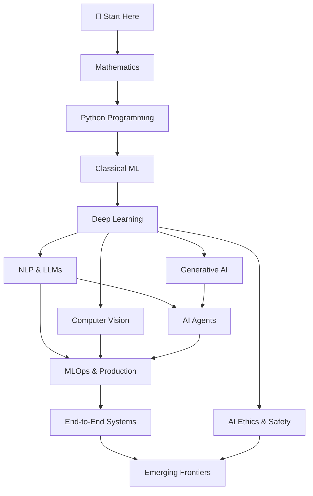

# AI

**From Foundations to Production — A Structured Path to Becoming an AI Expert**

---

## 📖 Overview

This repository is my **structured, comprehensive journey** to mastering Artificial Intelligence. It covers everything from the mathematical foundations to cutting-edge topics like Large Language Models (LLMs), Diffusion Models, and AI Agents.

The goal is not just to learn theory, but to **build, deploy, and understand** AI systems at a production level. Every topic includes hands-on implementation, and the curriculum is designed to be followed sequentially or explored modularly based on your existing knowledge.[reference:0][reference:1]

## 🎯 Why This Repository?

- **Complete Coverage:** 20+ core domains spanning Mathematics, Classical ML, Deep Learning, NLP, Computer Vision, Reinforcement Learning, Generative AI, MLOps, and more.
- **Structured Learning:** Each directory contains a detailed `TODO.md` with every sub-topic that must be covered.
- **Project-Based:** Theory is paired with practical projects to solidify understanding.
- **Production-Focused:** Includes MLOps, system design, and deployment strategies — not just Jupyter notebooks.
- **Open-Source & Evolving:** Contributions and suggestions are always welcome.

---

## 📂 Repository Structure

| Directory | Description |
|-----------|-------------|
| [`AgentDesign/`](./AgentDesign) | Intelligent agent architectures, PEAS framework, multi-agent systems |
| [`Applications/`](./Applications) | Real-world AI applications across healthcare, finance, autonomous vehicles, etc. |
| [`CV/`](./CV) | Computer Vision — CNNs, object detection (YOLO, R-CNN), segmentation, Vision Transformers |
| [`DL/`](./DL) | Deep Learning fundamentals — backpropagation, optimizers, regularization, attention |
| [`Diffusion/`](./Diffusion) | Diffusion models — DDPM, score-based models, Stable Diffusion |
| [`EdgeAI/`](./EdgeAI) | Deploying AI on edge devices — quantization, pruning, TinyML |
| [`Ethics&XAI/`](./Ethics&XAI) | AI ethics, fairness, explainability (SHAP, LIME), privacy, safety |
| [`Intro/`](./Intro) | Introduction to AI — history, paradigms, intelligent agents, applications |
| [`LLM/`](./LLM) | Large Language Models — Transformers, GPT, BERT, fine-tuning, RAG, prompt engineering |
| [`ML/`](./ML) | Classical Machine Learning — regression, classification, ensembles, clustering |
| [`MLOPs/`](./MLOPs) | MLOps — experiment tracking, CI/CD, model monitoring, Kubernetes, feature stores |
| [`Math/`](./Math) | Mathematical foundations — linear algebra, calculus, probability, statistics |
| [`NLP/`](./NLP) | Natural Language Processing — tokenization, embeddings, RNNs, Transformers |
| [`Philosophy/`](./Philosophy) | Philosophical foundations — Turing Test, Chinese Room, consciousness, AI alignment |
| [`RL/`](./RL) | Reinforcement Learning — MDPs, Q-Learning, DQN, policy gradients, PPO |
| [`Robotics/`](./Robotics) | AI for robotics — kinematics, SLAM, path planning, ROS |
| [`Speech/`](./Speech) | Speech processing — ASR, TTS, speaker recognition, speech enhancement |
| [`SysDesign/`](./SysDesign) | System design for AI — recommendation systems, search, chatbots, scalability |
| [`VLM/`](./VLM) | Vision-Language Models — CLIP, LLaVA, multimodal AI |
| [`Career_Projects/`](./Career_Projects) | Capstone projects and portfolio building |

---

## 🗺️ Learning Path

The curriculum follows a natural progression, but you can jump to any area based on your goals:

